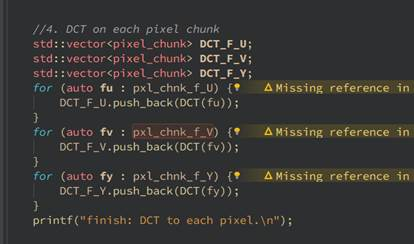

# Qt-ffmpeg-video-player-jpeg-codec

**一、实验目的**

1、掌握音频或视频编解码的基本原理

2、综合掌握音视频编解码的一般流程和实现方法

3、运用本学期学习的数字音视频技术实现一个简单的音视频应用

 

**二、实验要求**

从以下两个题目中选择一个，最终实现一个完整的音视频应用。

1、实现一个JPEG图像编解码的应用，要求满足下述功能：

（1）利用ffmpeg提取视频中的任意关键帧；

（2）实现JPEG编码器，具体包括将所提取图像的RGB像素值转化为YCbCr或者YUV，对色度图像进行二次采样（subsampling 4：2：0），对图像划分为8*8的像素块并进行DCT变换，进行量化；

（3）实现JPEG解码器，包括对步骤1中的量化结果进行反量化，IDCT变换，增采样，完成转换并显示图像；

（4）采用不同的质量因子，例如2，5，10，观察解码后图像的变化。

2、自行选择一个音频或视频的应用实现，要求有完整的编解码功能，并编辑应用程序说明文档。

 

**三、实验步骤**

附实验代码及说明文档

使用Qt+FFmpeg实现了一个视频播放器以及提取视频关键帧，并把视频中任意一帧使用JPEG编码解码为图片。

**1、视频播放器的实现**

**思路一：使用ffmpeg编解码+QWidget结合SDL2音视频同步实现：**

使用FFmpeg解码视频并播放的流程如下，先打开视频文件，然后分析视频头中解码器类型，然后查找解码器并打开，打开解码器后，就可以读取音视频帧，然后将音视频分离，并分别做格式转换，最后再应用中输出。


**核心思想**

**QT多线程**

因为视频解码过程消耗资源较多，必须单独开启一个线程来负责视频解码，主线程负责渲染以及控制，否则视频播放的过程中UI会卡住，无法响应用户事件。QT实现多线程有两种方法：

第一种是创建一个线程，类继承QThread，并且重写run方法，主线程中创建线程对象，使用start()方法启动线程，该部分网络上资料较多，此处不再赘述。

第二种创建一个类对象，继承QObject，创建与类对象链接的信号槽，通过类对象moveToThread方法将类对象移动到新线程中，然后调用线程对象的start方法，启动线程，调用信号槽，类对象在新线程中处理数据。

**视频解码核心代码：**

```c++
decoder->videoQueue.dequeue(&packet, true);
ret = avcodec_send_packet(decoder->pCodecCtx, &packet);
if ((ret < 0) && (ret != AVERROR(EAGAIN)) && (ret != AVERROR_EOF)) {
    qDebug() << "Video send to decoder failed, error code: " << ret;
    av_packet_unref(&packet);
    continue;
}

ret = avcodec_receive_frame(decoder->pCodecCtx, pFrame);
if ((ret < 0) && (ret != AVERROR_EOF)) {
    qDebug() << "Video frame decode failed, error code: " << ret;
    av_packet_unref(&packet);
    continue;
}

if (av_buffersrc_add_frame(decoder->filterSrcCxt, pFrame) < 0) {
    qDebug() << "av buffersrc add frame failed.";
    av_packet_unref(&packet);
    continue;
}

if (av_buffersink_get_frame(decoder->filterSinkCxt, pFrame) < 0) {
    qDebug() << "av buffersink get frame failed.";
    av_packet_unref(&packet);
    continue;
} else {
    QImage tmpImage(pFrame->data[0], decoder->pCodecCtx->width, decoder->pCodecCtx->height, QImage::Format_RGB32);
    /* deep copy, otherwise when tmpImage data change, this image cannot display */
    QImage image = tmpImage.copy();
    decoder->displayVideo(image);
}

```

 

**思路二：使用Qt自带的multimedia模块实现**

Qt中集成了多媒体、opengl渲染、网络等各种应用开发中常用的功能，所以可以使用qt自带的multimedia模块来完成视频播放的功能。

Qt的multimedia缺点在于支持的格式相比ffmpeg较少，但也能涵盖大部分的主流格式，而相比上面的方法更为稳定和便捷，所以采用了这种方法来实现视频播放功能。

**主要方法：**

实现播放器的播放功能是通过multimedia模块，在qt的QLabel上播放视频，打开文件是通过QtFileDialog，来打开系统的文件对话框并返回文文件路径实现的，进度条的拖拽和音量控制是通过重写了QSlider的滑动条，给QSlider添加了鼠标事件，来实现进度条和音量。

**核心代码：**

**视频播放：**

```c++
filename = QFileDialog::getOpenFileName(this,tr("选择视频文件"),".",
                                                    tr("视频格式(*.avi *.mp4 *.flv *.mkv)"));
    this->setWindowTitle(filename);
    ui->lineEdit->setText(filename);
    QFile file(filename);
    if(!file.open(QIODevice::ReadOnly))
    {
        QMessageBox::information(NULL, "Title", "Content", QMessageBox::Ok,
                                 QMessageBox::Ok);
        return;
    }
    if(if_reload)
    {//重新加载视频时，重置以下变量
        delete layout_video;
        delete player;
        delete widget;
        delete timer;
    }
    if_reload = true;

    //实例化三个全局变量
    layout_video = new QVBoxLayout;
    player = new QMediaPlayer;
    widget = new QVideoWidget;
    //设置视频播放区域与Label的边距
    layout_video->setMargin(1);
    //根据label_player尺寸设置播放区域
    widget->resize(ui->label->size());
    layout_video->addWidget(widget);
    ui->label->setLayout(layout_video);
    player->setVideoOutput(widget);

    //设置播放器
    player->setMedia(QUrl::fromLocalFile(filename));
    //play_state为true表示播放，false表示暂停
    play_state = true;
    ui->pushButton_Volume->setEnabled(true);
    ui->horizontalSlider->setEnabled(true);
    ui->horizontalSlider->setRange(0,maxValue);
    //启用播放/暂停按钮，并将其文本设置为“暂停”
    ui->pushButton_Player->setEnabled(true);
    ui->pushButton_Player->setText("暂停");

    timer = new QTimer();
    timer->setInterval(1000);
    timer->start();

    connect(timer,SIGNAL(timeout()),this,SLOT(onTimerOut()));
    //播放器开启
    player->play();

```

**滑动条重写：**

```c++
void CustomSlider::mousePressEvent(QMouseEvent *ev)
{
    QSlider::mousePressEvent(ev);
    double pos = ev->pos().x()/(double)width();
    setValue(pos*(maximum()-minimum())+minimum());
    //发送自定义的鼠标事件
    emit costomSliderClicked();
}

```

 

**截图：**

**选择打开文件：**


**播放视频：**


**暂停视频：**


**调节音量：**


 

**2、获取视频所有关键帧并保存**

**关键帧介绍**

  视频压缩中，每帧代表一幅静止的图像。而在实际压缩时，会采取各种算法减少数据的容量，其中IPB就是最常见的。

  简单地说，I帧是关键帧，属于帧内压缩。就是和AVI的压缩是一样的。P是向前搜索的意思。B是双向搜索。他们都是基于I帧来压缩数据。

  I帧表示关键帧，可以理解为这一帧画面的完整保留；解码时只需要本帧数据就可以完成（因为包含完整画面）

  P帧表示的是这一帧跟之前的一个关键帧（或P帧）的差别，解码时需要用之前缓存的画面叠加上本帧定义的差别，生成最终画面。（也就是差别帧，P帧没有完整画面数据，只有与前一帧的画面差别的数据）

  B帧是双向差别帧，也就是B帧记录的是本帧与前后帧的差别（具体比较复杂，有4种情况），换言之，要解码B帧，不仅要取得之前的缓存画面，还要解码之后的画面，通过前后画面的与本帧数据的叠加取得最终的画面。B帧压缩率高，但是解码时CPU会比较累~。

 

**核心代码：**

```c++
//为每帧图像分配内存
        pFrame = av_frame_alloc();
        pFrameRGB = av_frame_alloc();

        if (pFrame == NULL || pFrameRGB == NULL) {
            printf("av frame alloc failed!\n");
            return -1;
        }
        //获得帧图大小
        PictureSize = avpicture_get_size(AV_PIX_FMT_BGR24, pCodecCtx->width, pCodecCtx->height);
        buf = (uint8_t*)av_malloc(PictureSize);
        if (buf == NULL) {
            printf("av malloc failed!\n");
            return -1;
        }
        avpicture_fill((AVPicture *)pFrameRGB, buf, AV_PIX_FMT_BGR24, pCodecCtx->width, pCodecCtx->height);
        //设置图像转换上下文
        pSwsCtx = sws_getContext(pCodecCtx->width, pCodecCtx->height, pCodecCtx->pix_fmt, pCodecCtx->width, pCodecCtx->height, AV_PIX_FMT_BGR24, SWS_BICUBIC, NULL, NULL, NULL);
        i = 0;
        while (av_read_frame(pFormatCtx, &packet) >= 0) {
            if (packet.stream_index == videoStream) {
                //解码
                avcodec_decode_video2(pCodecCtx, pFrame, &frameFinished, &packet);
                if (frameFinished) {
                    if (pFrame->key_frame) {
                        //转换图像格式，将解压出来的YUV420P的图像转换为BRG24的图像
                        sws_scale(pSwsCtx, (const uint8_t* const*)pFrame->data, pFrame->linesize, 0, pCodecCtx->height, pFrameRGB->data, pFrameRGB->linesize);
                        //保存为bmp图
                        SaveAsBMP(pFrameRGB, pCodecCtx->width, pCodecCtx->height, i, 24, outfile);
                        i++;
                    }
                }
                av_free_packet(&packet);
            }
        }

```

 

提取到的关键帧：


**3****、****JPEG****编解码**

JPEG（ Joint Photographic Experts Group）即联合图像专家组，是用于连续色调静态图像压缩的一种标准，文件后缀名为，jpg或，jpeg，是最常用的图像文件格式。其主要是采用预测编码（DPCM）、离散余弦变换（DCT）以及熵编码的联合编码方式，以去除冗余的图像和彩色数据，属于有损压缩格式，它能够将图像压缩在很小的储存空间，一定程度上会造成图像数据的损伤。尤其是使用过高的压缩比例，将使最终解压缩后恢复的图像质量降低，如果追求高品质图像，则不宜采用过高的压缩比例。

 

JPEG压缩编码算法的主要计算步骤如下：

(0) 8*8分块。

(1) 正向离散余弦变换(FDCT)。

(2) 量化(quantization)。

(3) Z字形编码(zigzag scan)。

(4) 使用差分脉冲编码调制(DPCM)对直流系数(DC)进行编码。

(5) 使用行程长度编码(RLE)对交流系数(AC)进行编码。

(6) 熵编码。


**具体实现：**

RGB to YUV


二次采样


图像划分为8*8的像素块:


DCT变换



量化


 

 

JPEG解码

JPEG解码为编码的逆过程：

1. 解码Huffman数据
2. 解码DC差值
3. 重构量化后的系数
4. DCT逆变换
5. 丢弃填充的行/列
6. 反0偏置
7. 对丢失的CbCr分量差值（下采样的逆过程）
8. YCbCr → RGB

 

反量化


IDCT变换


增采样


恢复图像并保存


 

**实验结果：**


 

质量因子为2：


质量因子为5：


质量因子为10：

